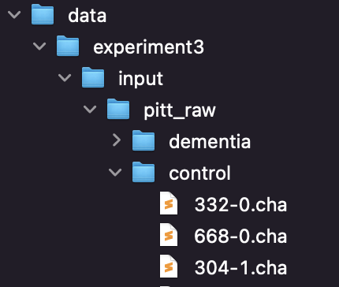

## Overview
This repository contains the source code for the models used for the submission Semantic Coherence Markers: the Contribution of Perplexity Metrics.

## Prerequisites
#### 1 - Install Requirements
```
conda env create -f environment.yml
```
NB. It requires [Anaconda](https://www.anaconda.com/distribution/)

#### 2 - Download the transcript from the URL list and the documents from the Pitt Corpus

##### Experiment 1
In order to run the experiments, the texts have to be placed in the input directory for each experiment.
To download the texts related to the first experiments please use the URLs contained in the file `URLs_experiment1.txt`, such list is divided for both Interviews and Rally speeches. Copy the text form the speaker only (discarding interviewers and/or croud entries) and paste in separate files, one for each interview/rally. The files have to be partitioned in two different folders placed in the `data/experiment1/input/` (one for each category).
The final folders structure should resemble the following image:


##### Experiment 2
In order to download the texts related to the second experiment please use the URLs contained in the file `URLs_experiment2.txt`, such list is divided for each speaker. As for the first experiment, copy the text form the speaker only and past each speech in separate files. The files have to be organized in folders, one for each speaker, and such folders have to be placed in the `data/experiment2/input/speeches/` directory.
The final folders structure should resemble the following image:


##### Experiment 3
Running the third experiment requires to have access to the [DementiaBank's Pitt Corpus](https://dementia.talkbank.org/access/English/Pitt.html).
Once Pitt Corpus have been downloaded, retain the interviews related to the Cookie Theft only. The data have to be placed into a directory named `pitt_raw`, such directory have to contains two subdirectories `control` and `dementia`. All the speeches from the control group have to be placed into the `control` directory, while the `dementia` directory have to contain all the speeches from the AD group. 
The `pitt_raw` directory should be placed in the following folder `data/experiment3/input/`.

The final folders structure should resemble the following image:


where both control and dementia directories contain all the transcriptions from the Pitt Corpus as follows:


#### 3 - Download pre-trained models and fine-tuned models
Download GPT2 data from [this link](https://drive.google.com/file/d/1YYMmFlwrNnuQSgUnDlteSrLopm82VyCo/view?usp=sharing) (295GB) and unpack the archive in the resource folder.

## Execution
In order to reproduce the submission results run the scripts in 'src/run/' package. In particular, from the src folder run the command:
```
python -m run.experiment1
```
to run the first experiment. The script will fine-tune the GPT2 model for [0,5,10,20,30] epochs and acquire N-grams ranging N from 2 to 5.

In order to run the second experiment run the following command:
```
python -m run.experiment2
```
as for the first experiment, the script will go through all the experimental settings presented in the article and will compute the ICC score.

Finally, to run the third experiment run the following command:
```
python -m run.experiment3
```
as for the previous settings, the script will run all the conditions presented in the paper. The evaluation metrics will be computed after all the LMs have been acquired.

In order to avoid long training times, all the experimental conditions have been optimized, if the GPT2 models have been downloaded and unpacked in the resource folder, the scripts skip the fine-tuning phase; they start the training otherwise.
